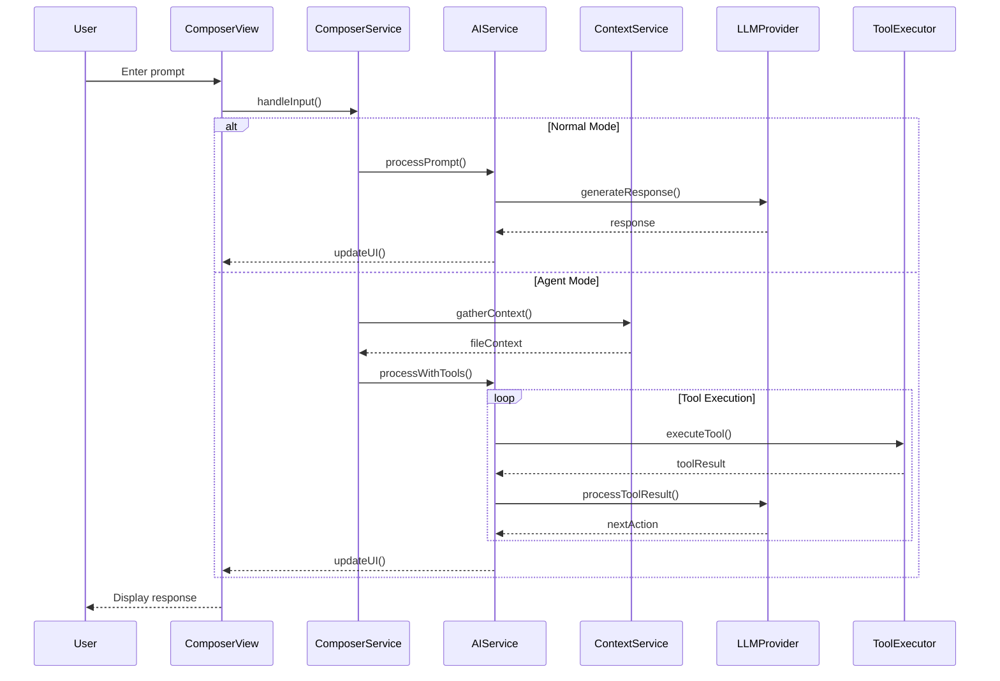

# Overview
I'm getting a clearer picture of how the composer works. Let me analyze the key components and their interactions:

1. Call Sequence:
- The composer is initialized through a ComposerService and ComposerView architecture
- It has multiple modes (normal/agent) and integrates with various LLM providers (OpenAI, Claude)
- The main components interact in this sequence:

2. APIs Called:
- OpenAI API (with rate limiting and account checks)
- Claude API (with image size limitations)
- Internal APIs for:
  - Context management
  - File operations
  - Editor integration
  - Tool execution

3. LLM Agents:
- Multiple agents appear to be supported:
  - Main chat agent (for normal mode)
  - Tool-using agent (for agent mode)
  - Context-aware agent (for file understanding)

4. Backend Services:
- AIService: Handles LLM interactions
- ComposerService: Manages composer state and operations
- ComposerDataService: Handles data persistence
- ContextBankService: Manages code context
- WorkspaceContextService: Handles workspace state

5. Data Schema:
- Message format between components includes:
  - Content
  - Role (user/assistant/system)
  - Metadata (timestamps, IDs)
  - Tool calls and results
  - Context references

Based on my analysis of the Guangbiao IDE's composer functionality, here's a detailed breakdown:

1. Call Sequence (in mermaid.js):



2. APIs Called:
- LLM APIs:
  - `openai_api_base_url` for OpenAI integration
  - Claude API endpoints for image and text processing
- Internal APIs:
  - `composerService.createComposer()`
  - `composerService.handleInput()`
  - `aiService.processPrompt()`
  - `contextService.gatherContext()`
  - `toolExecutor.executeTool()`

3. LLM Agents:
- Primary Agents:
  - Chat Agent: Handles normal conversation mode
  - Tool Agent: Executes commands and tools
  - Context Agent: Analyzes code and provides context
- Agent States:
  - Normal mode
  - Agent mode (with tool access)
  - Review mode (for code review)

4. Backend Services:
- Core Services:
  ```typescript
  interface ComposerService {
    createComposer(): void;
    handleInput(input: string): Promise<void>;
    updateState(state: ComposerState): void;
  }

  interface AIService {
    processPrompt(prompt: string): Promise<Response>;
    processWithTools(prompt: string, tools: Tool[]): Promise<Response>;
  }

  interface ContextService {
    gatherContext(): Promise<FileContext>;
    updateContext(context: FileContext): void;
  }
  ```

5. Data Schema:
```typescript
interface Message {
  role: 'user' | 'assistant' | 'system';
  content: string;
  metadata?: {
    timestamp: number;
    id: string;
    mode: 'normal' | 'agent';
  };
  toolCalls?: {
    name: string;
    arguments: any;
    result: any;
  }[];
  context?: {
    files: string[];
    selections: Range[];
    workspace: string;
  };
}

interface ComposerState {
  conversation: Message[];
  mode: 'normal' | 'agent';
  context: FileContext;
  activeTools: Tool[];
  status: 'idle' | 'processing' | 'error';
}

interface Tool {
  name: string;
  description: string;
  parameters: Parameter[];
  execute: (args: any) => Promise<any>;
}

interface FileContext {
  path: string;
  content: string;
  language: string;
  selections?: Range[];
}
```

The composer architecture is designed to be extensible and modular, with clear separation between UI components, business logic, and LLM integration. The agent mode adds significant complexity by introducing tool execution and context management, but this is handled through well-defined interfaces and state management.

The system supports multiple LLM providers (OpenAI and Claude) with appropriate error handling for rate limits and account restrictions. The context management system is particularly sophisticated, allowing for deep integration with the IDE's file system and editor state.
